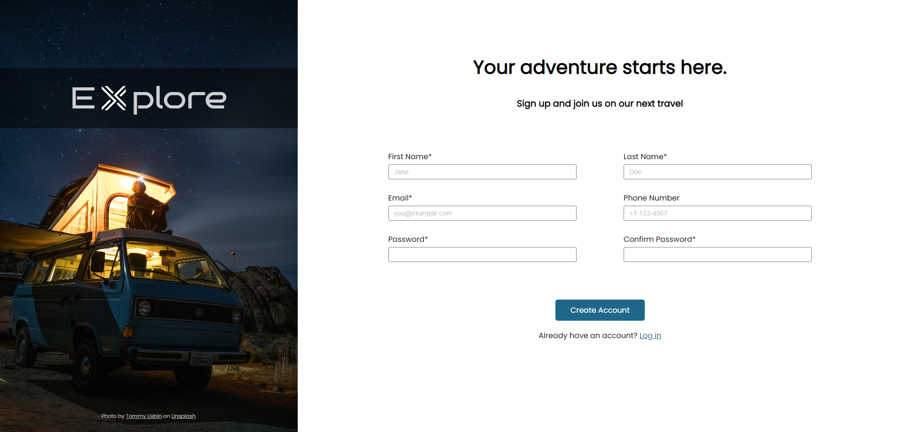

# Sign Up Form

## Introduction
This project was built with plain HTML and CSS and it is part of [The Odin Project's curriculum](https://www.theodinproject.com/).

## Screenshot

## Live Demo
This project is hosted on my GitHub Pages and you can access it [in here](https://daniellima0.github.io/sign-up-form/).

## Key Concepts
* Forms Styling
* Forms Validation